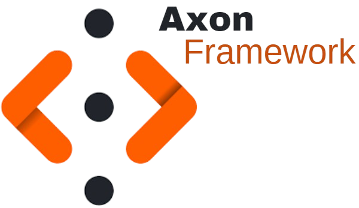
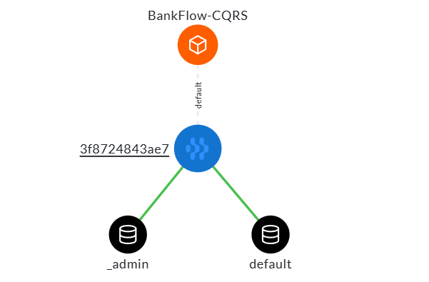
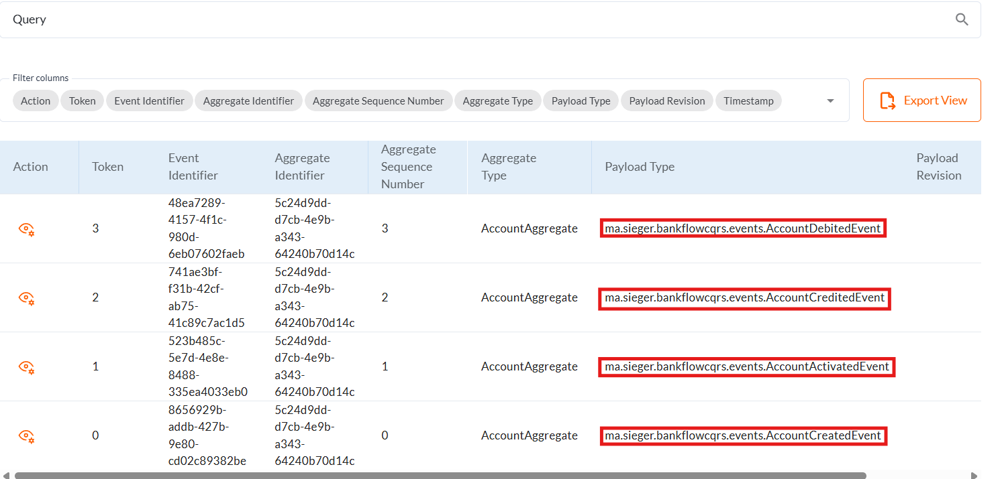
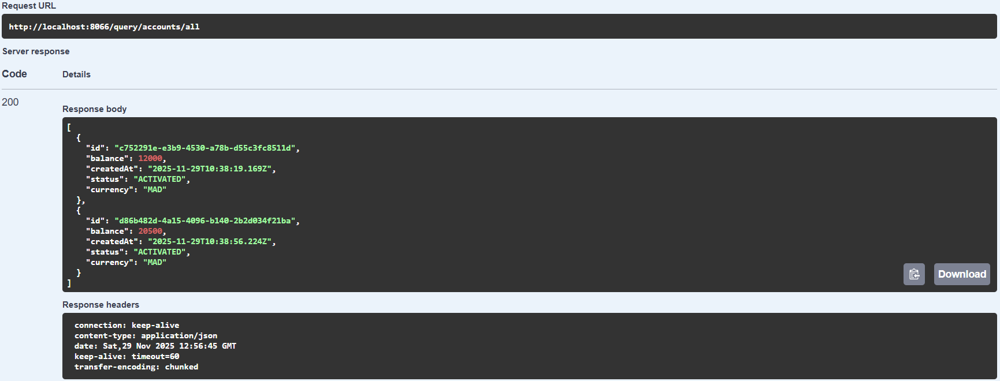

  

<h1 align="center">BankFlow CQRS & Event Sourcing</h1>

<h4 align="center">Spring Boot & Axon Banking App implementing CQRS and Event Sourcing.</h4>

    
    
    
    

**BankFlow-CQRS** is a proof-of-concept banking system implementing the **CQRS** (Command Query Responsibility Segregation) and **Event Sourcing** design patterns. Built with **Spring Boot** and the **Axon Framework**, this application demonstrates how to decouple write operations (commands) from read operations (queries) to ensure scalability and auditability in financial transactions.

<h2>Project Architecture</h2>

The application follows a strict separation of concerns:

<ul>
  <li><strong>Command Side (Write Model):</strong> Handles business logic and state changes via the <code>AccountAggregate</code>. All state changes are persisted as a sequence of events (Event Sourcing) in the Axon Server Event Store.</li>
  <li><strong>Query Side (Read Model):</strong> Event handlers listen for events emitted by the aggregate to update the projection database (PostgreSQL). This allows for optimized read operations separate from the transactional logic.</li>
  <li><strong>Event Store:</strong> Acts as the single source of truth, storing every state change (Account Created, Credited, Debited, Activated).</li>
</ul>

<h2>Technology Stack</h2>

<table>
  <thead>
    <tr>
      <th>Component</th>
      <th>Technology</th>
      <th>Role</th>
    </tr>
  </thead>
  <tbody>
    <tr>
      <td><strong>Core Framework</strong></td>
      <td>Spring Boot 3.4.12</td>
      <td>Application context and dependency injection</td>
    </tr>
    <tr>
      <td><strong>CQRS Engine</strong></td>
      <td>Axon Framework 4.10.3</td>
      <td>Command bus, Event bus, and Aggregate lifecycle management</td>
    </tr>
    <tr>
      <td><strong>Language</strong></td>
      <td>Java 21</td>
      <td>Backend logic</td>
    </tr>
    <tr>
      <td><strong>Read Database</strong></td>
      <td>PostgreSQL 16</td>
      <td>Relational database for query projections</td>
    </tr>
    <tr>
      <td><strong>Event Store</strong></td>
      <td>Axon Server</td>
      <td>Dedicated event storage and message routing</td>
    </tr>
     <tr>
      <td><strong>Containerization</strong></td>
      <td>Docker & Docker Compose</td>
      <td>Infrastructure orchestration</td>
    </tr>
  </tbody>
</table>

<h2>Prerequisites</h2>

Ensure the following are installed on your local environment:
* **Java 21 SDK**
* **Docker Desktop** (or Docker Engine with Compose)
* **Maven** (Optional: Wrapper included)

<h2>Getting Started</h2>

<h3>1. Infrastructure Setup</h3>
The project utilizes Docker Compose to spin up the necessary infrastructure.

<pre><code>docker-compose up -d</code></pre>

This will start the Axon Server Dashboard and PostgreSQL database.

 

<em>Figure 1: Axon Server Dashboard Overview</em>

You can view the specific events generated by your commands (Created, Activated, Credited, etc.) directly in the Axon Server interface:

 

<em>Figure 2: Event Stream History in Axon Server</em>

* **Axon Server Dashboard:** <a href="http://localhost:8024">http://localhost:8024</a>
* **PostgreSQL:** Port <code>5432</code> (User: <code>admin</code>, Pass: <code>1234</code>)
* **PgAdmin:** <a href="http://localhost:8088">http://localhost:8088</a>

<h3>2. Application Configuration</h3>
The application is configured via `src/main/resources/application.properties`. By default, it runs on port **8066** and connects to the containerized PostgreSQL instance.

<h3>3. Build and Run</h3>
Use the included Maven wrapper to build and start the application:

<pre><code>./mvnw clean install
./mvnw spring-boot:run</code></pre>

<h2>API Reference</h2>

The application exposes REST endpoints for both Command and Query operations.

<h3>Command API (Write Operations)</h3>
All commands are asynchronous and return a `CompletableFuture`.

<strong>Create New Account</strong>

 
<strong>POST</strong> <code>/commands/accounts/add</code>

<strong>Body:</strong>

<pre><code>{
  "initialBalance": 1000.0,
  "currency": "MAD"
}</code></pre>

<strong>Credit Account</strong>

 
<strong>POST</strong> <code>/commands/accounts/credit</code>

<strong>Body:</strong>

<pre><code>{
  "accountId": "UUID-STRING",
  "amount": 500.0,
  "currency": "MAD"
}</code></pre>

<strong>Debit Account</strong>

 
<strong>POST</strong> <code>/commands/accounts/debit</code>

<strong>Body:</strong>

<pre><code>{
  "accountId": "UUID-STRING",
  "amount": 200.0,
  "currency": "MAD"
}</code></pre>

<strong>Update Account Status</strong>

 
<strong>PUT</strong> <code>/commands/accounts/updateStatus</code>

<strong>Body:</strong>

<pre><code>{
  "accountId": "UUID-STRING",
  "accountStatus": "SUSPENDED" 
}</code></pre>

<em>Statuses: CREATED, ACTIVATED, SUSPENDED, BLOCKED</em>

<h3>Query API (Read Operations)</h3>

<strong>Get All Accounts</strong>

 
<strong>GET</strong> <code>/query/accounts/all</code>

Returns a list of current account states from the projection database.

 

<em>Figure 3: Example response for retrieving all accounts</em>

<strong>Get Account Statement</strong>

 
<strong>GET</strong> <code>/query/accounts/accountStatement/{accountId}</code>

Returns the account details along with the full history of operations (Credits/Debits).

<strong>Watch Account (Real-time SSE)</strong>

 
<strong>GET</strong> <code>/query/accounts/watch/{accountId}</code>

Establishes a Server-Sent Events (SSE) stream to receive real-time updates for a specific account.

<h3>Event Store API</h3>

<strong>Read Events</strong>

 
<strong>GET</strong> <code>/commands/accounts/events/{accountId}</code>

Directly reads the event stream for a specific Aggregate ID from the Axon Event Store.

<h2>Development & Testing</h2>

The project uses Lombok to reduce boilerplate code. Ensure your IDE has the Lombok plugin installed and annotation processing enabled.

To run the unit tests:
<pre><code>./mvnw test</code></pre>

<h2>Database Schema</h2>

The application uses Hibernate to automatically generate the schema in PostgreSQL.
* **Account:** Stores the current state (Balance, Status, Currency).
* **AccountOperation:** Stores the transaction history linked to an account (Credit/Debit operations).

<strong>By:</strong> DJILI Mohamed Amine, Engineering student at ENSET Mohammedia cybersecurity and digital trust
